## 1. Typora 常用快捷键

### 1.1. 标题快捷键

1. ctrl + 1 一级标题
2. ctrl + 2 二级标题

### 1.2. 代码块

```
ctrl shift k 代码块快捷键
```

```java
```java java语言代码块
```

```shell
```shell shell语言代码块#tab 键上面的一个键，按 shift 切换成英文
```

### 1.3. 列表

1. 有序列表

   ```java
   //有序
   ctrl + shift + [
   ```

2. 无序列表

   ```java
   //无序
   ctrl + shift + ]
   ```

### 1.4. 缩进

1. 增加缩进
   - ctrl + ] 增加缩进
2. 减少缩进
   - ctrl + [ 减少缩进

### 1.5. 常用操作

```java
ctrl + c //拷贝
ctrl + v //粘贴
ctrl + x //剪切
ctrl + z //撤销
```

### 1.6. 文字格式

1. 加粗
   - ctrl + b
2. 斜体
   - ctrl + i
3. 下划线
   - ctrl + u


## 2. dos 命令以及常见的系统快捷键

1. dos 命令

   - 键盘

     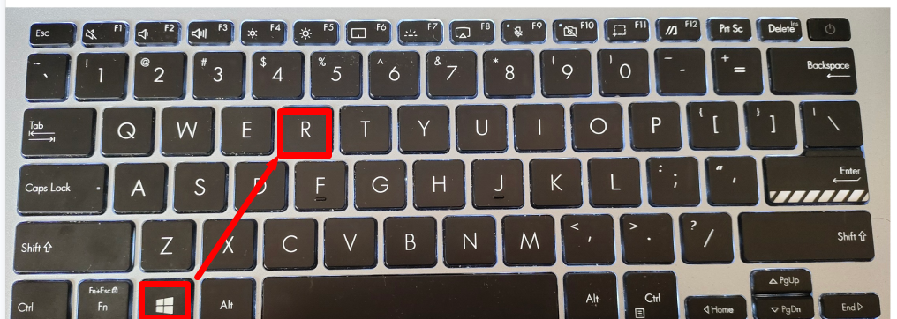

   - 打开运行窗口

     

   - 常见命令

     - win + r //打开cmd

       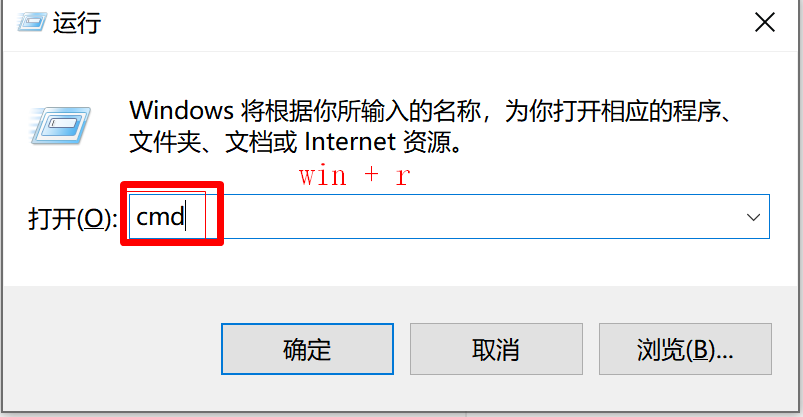

     - ipconfig //查看ip

       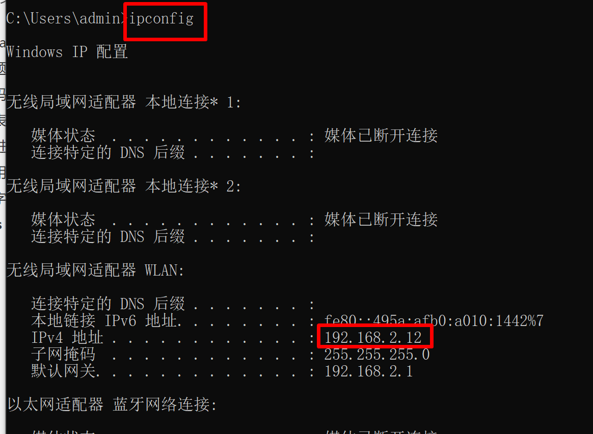

     - cls //清屏

       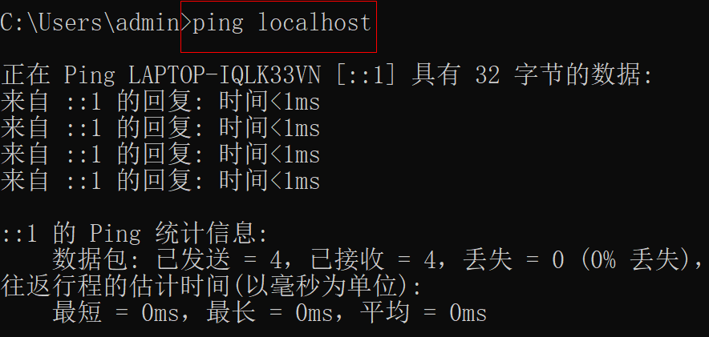

     - ping //查看ip 通否

       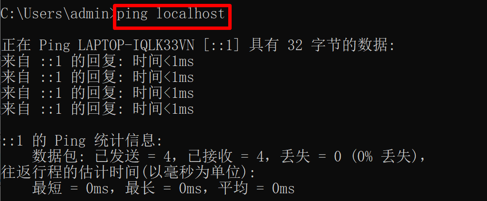

     - p盘符：去对应的盘符

       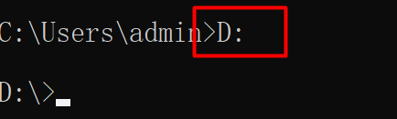

     - cd javase 去 javase 目录

       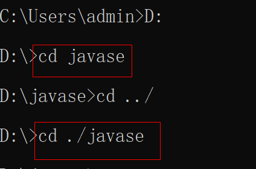

   - 系统常见快捷键

     - win + e 打开我的电脑
     - win + d 快速回到桌面
     - win + L 锁屏
     - alt + tab 切换窗口

## 3. java 概述

1. 计算机的组成

   - 硬件：CPU、内存、硬盘、主板
   - 软件：系统软件，应用软件

2. 计算机语言发展史

3. java语言发展史

4. java 语言特点

   - 简单性，没有指针的概念，不允许通过指针操作内存，只支持单继承

   - java 跨平台

     - 平台：windows linux mac

     - java 可以运行到任何操作系统之上

     - 实现跨平台需要java 虚拟机 jvm

       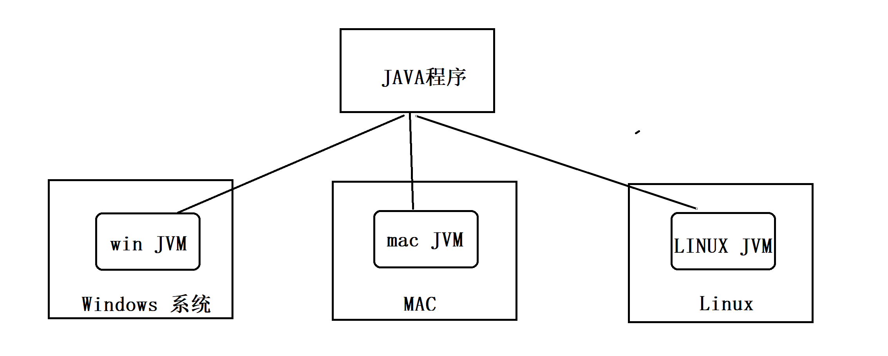

## 4. jdk 安装

1. jdk 安装

   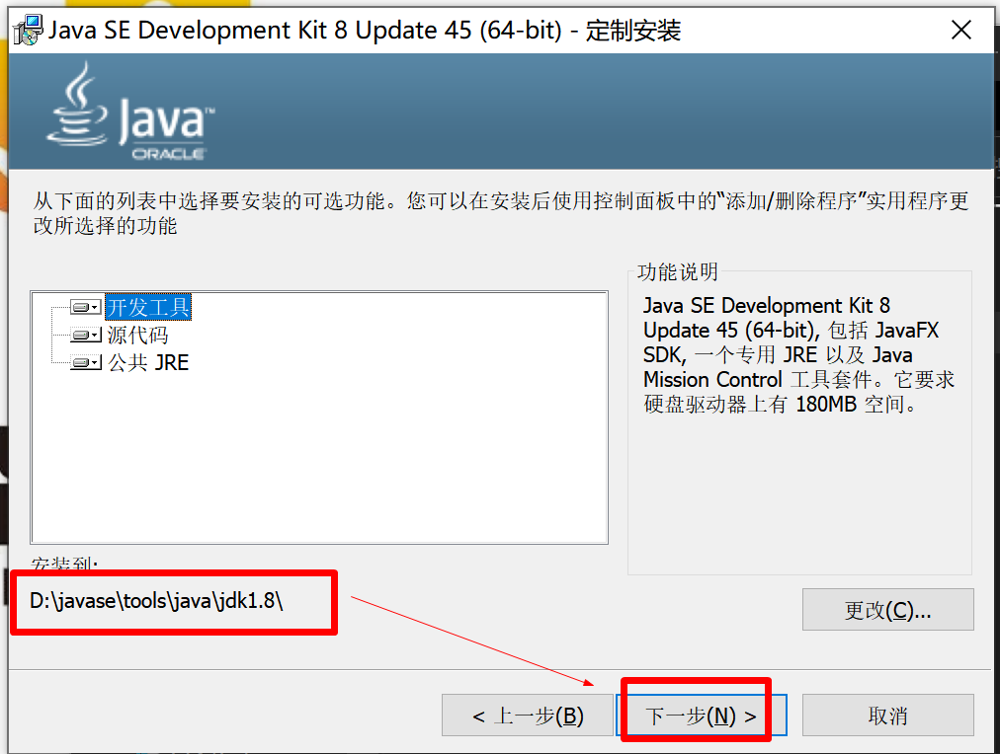

   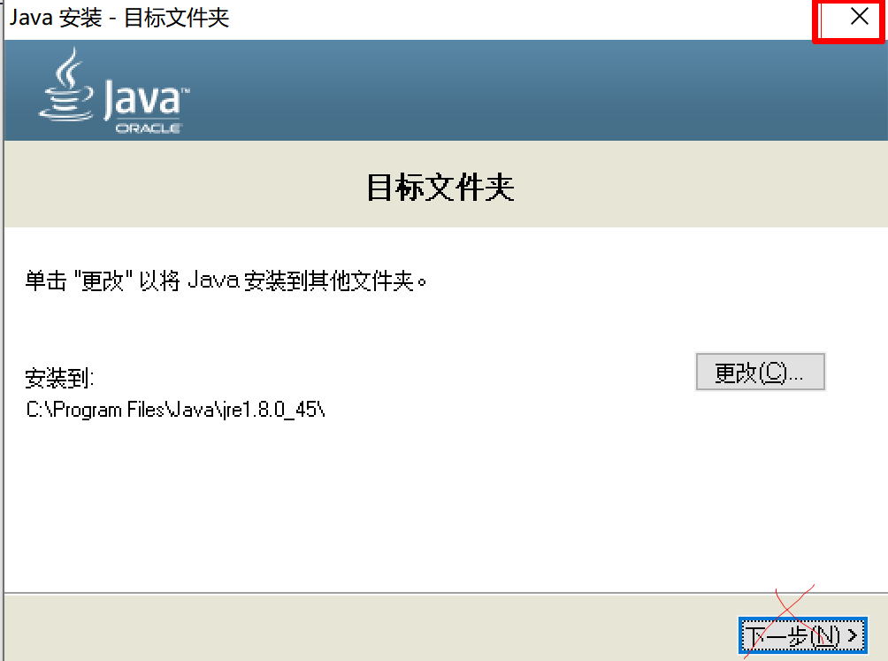

   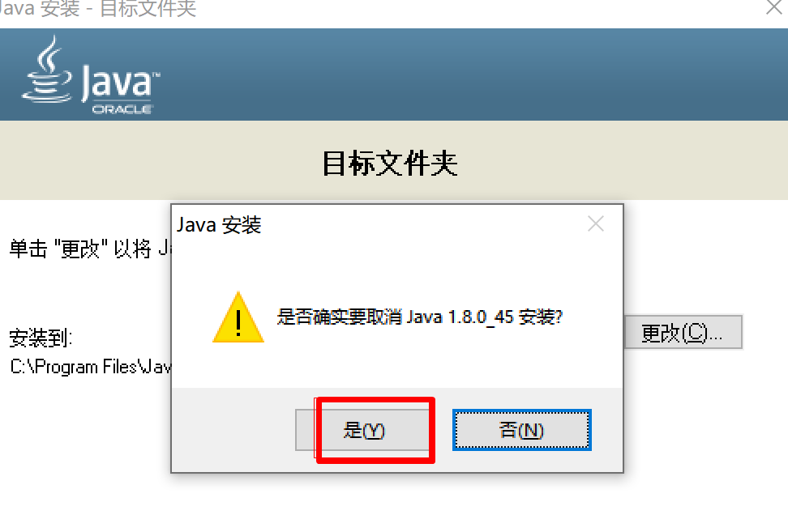

   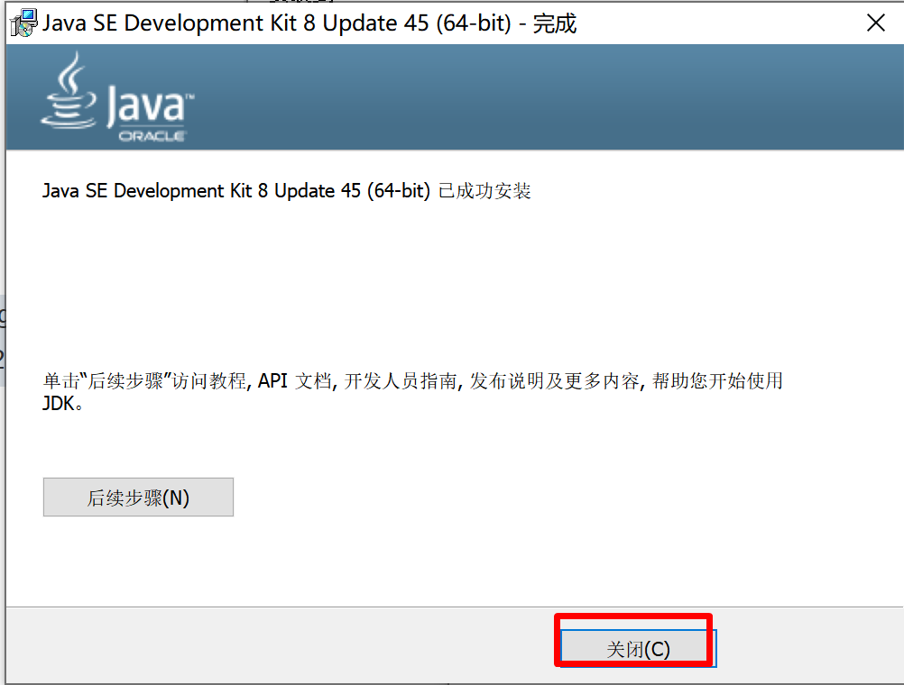

   

   

## 5. 环境变量

1. 环境变量的配置

   - 此电脑-右键属性-高级系统设置-环境变量-配置 JAVA_HOME-配置path-%JAVA_HOME%\bin

   - 测试 java -version javac -version

     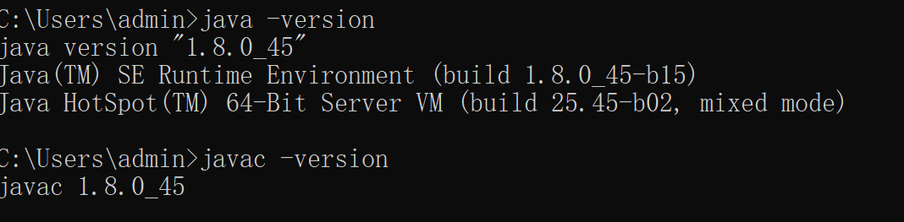


## 6. jdk 与 jre 关系

1. jdk: 它是java的开发运行环境，开发人员需要安装jdk
2. jre: java runtime environment(java 运行环境)，如果只需要运行程序，不需要开发，可以只安装jre
3. jdk 包含了 jre


## 7. java 加载和执行的过程

1. 图解

   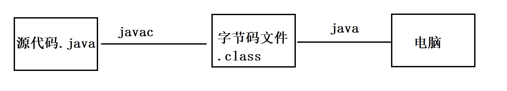

2. java 源文件：程序员编写的，扩展名是以.java 结尾的

3. 编译：通过 javac 把java源文件编译成字节码文件（.class结尾）

4. 运行：通过解释器（java）运行字节码文件

5. 需要用到 dos 命令


## 8. java 第一个程序 HelloWorld.java

1. 建好作业的包，practice 是课堂练习，task 是作业

2. 新建文件 HelloWorld.txt

3. 编写源代码(shift + [)

   ```java
   public class HelloWorld{
       public static void main(String[] args){
           System.out.println("HelloWorld");
       }
   }
   ```

4. 代码分析

   - 最外层分析

     ```java
     public class HelloWorld{
     //public 代表公共的，是一个修饰符
     //class 带表类的关键字
     //HelloWorld 类名
     //{}
     }
     ```

   - 中间层

     ```java
     public static void main(String[] args){
     //public 代表公共的，是一个修饰符
     //static 代表静态的，是一个关键字
     //void 代表没有返回类型
     //main 带表程序入口
     //String[] args 代表数组，程序参数
     }
     ```

   - 内层

     ```java
     System.out.println("HelloWorld");//输出语句，输出 HelloWorld
     ```

5. 常见错误

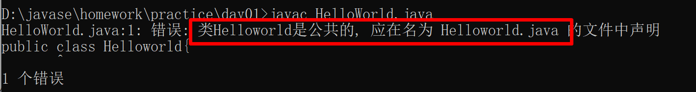

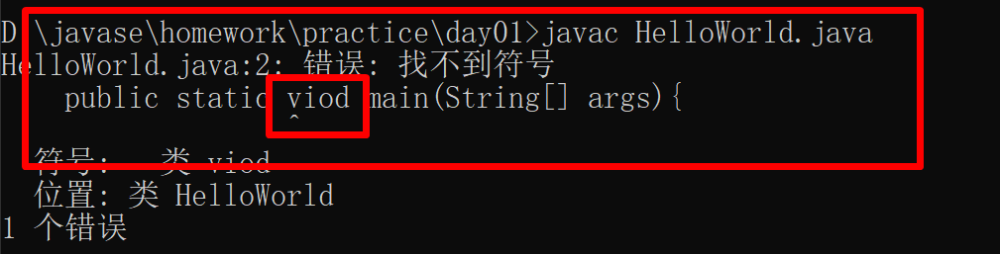

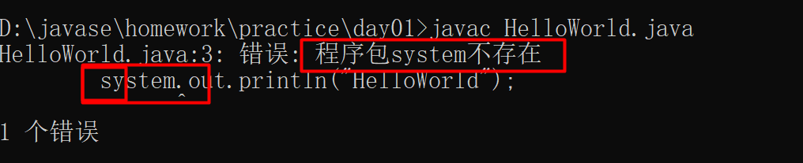

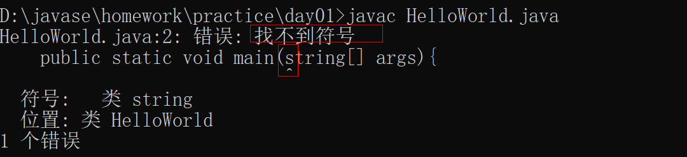

6. 正常情况

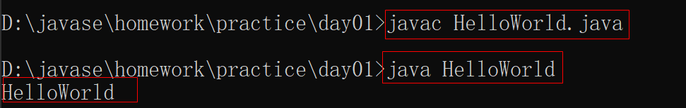

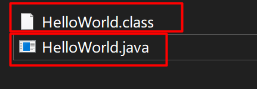

## 9. notepad++ 的安装和使用

1. 打开java 文件进行编辑，编辑完成记得 ctrl + s 保存

2. 编码：

   - 右下角出现 Utf-8(导致乱码)

   - 修改成 GB2312（编码->编码字符集->中文->GB2312）

     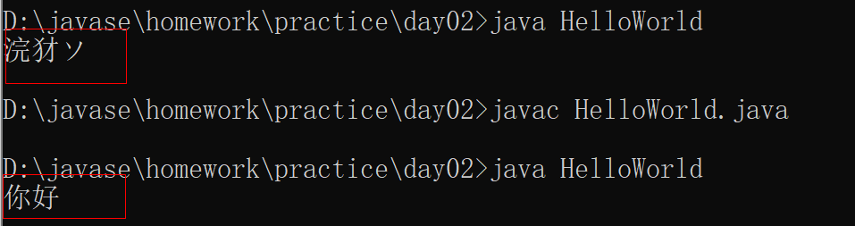

## 10. Java注释、关键字、标识符

### 10.1. java 注释

1. 通常我们需要在源代码中添加文字去描述我们代码的作用，做一个解释说明，直接写就会报错，所以我们就可以用java 的注释来解决这一问题
2. java 提供了三种注释方式：
   - 单行注释  //注释内容
   - 多行注释 /* 注释内容 */
   - 文档注释 /** 注释内容 */

### 10.2. 关键字

### 10.3. 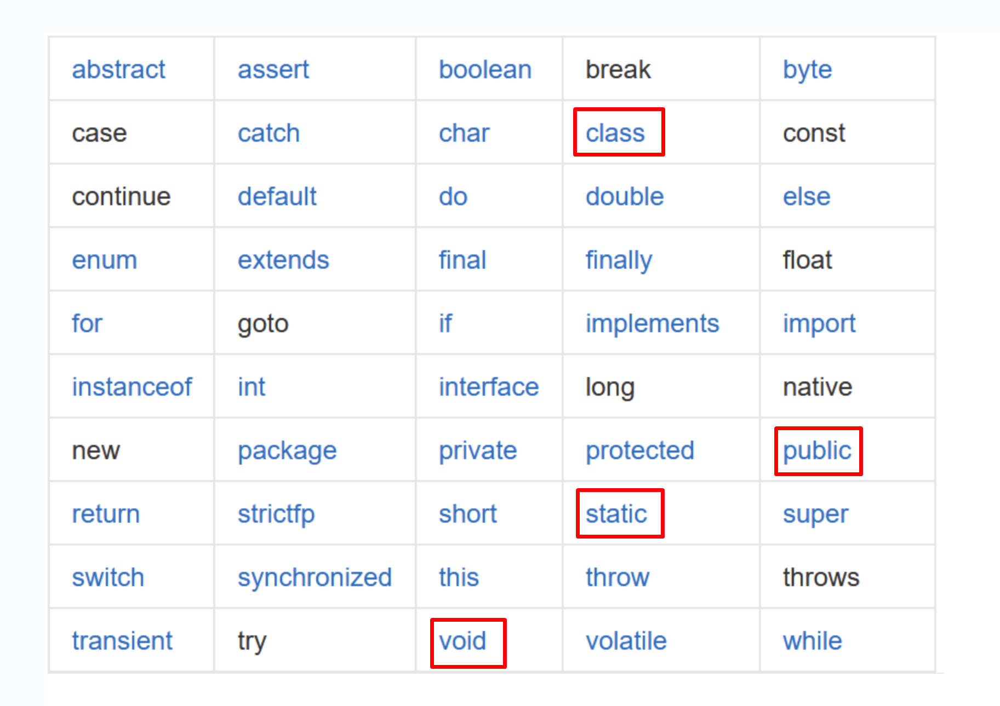

1. 关键字是我们 JAVA语言一些特殊的字母，具有特殊含义，java 中关键字是小写字母开头


### 10.4. 标识符

1. 标识符就是名称的意思，定义类，包，方法，变量名，目的是有一个号的命名。

2. 标识符的组成：

   - 英文的大小写字母 a-z A-Z
   - 数字 0-9
   - 符号 _ 与 $

3. 标识符规则

   - 数字不能打头

   - 不可以使用关键字

   - 严格区分大小写，做到见名知意

   - 驼峰命名法（类名第一个单词的首字母大小，其它单词的首字母也大小）

     ```java
     public class StudentTest{
       //驼峰命名法  
     }
     ```

     

## 11. 计算机的存储单元

1. 计算机的内存是如何存储数据？计算机的最小存储单元叫字节（byte）可以用大写字母B来表示,计算机存储设备的最小信息单元叫位（bit）小写字母b来表示。

   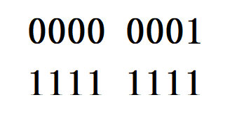

2. 存储单元：

   - 1B（字节）= 8位
   - 1KB = 1024B
   - 1MB = 1024KB
   - 1GB = 1024MB
   - 1TB = 1024GB

### 11.1. 进制换算

1. 十进制数 0 ，1 ，4，9

2. 二进制数 0,1

3. 八进制数 (0) 0,1,7

4. 十六进制（0X） 0,9，A,B,C,D,E,F

5. 十进制数转换成二进制数

   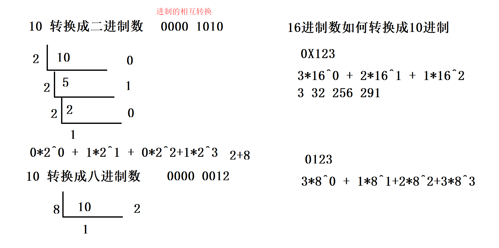

## 12. 数据类型

1. 基本数据类型

   |  四类  |    八种     | 字节数 |        数据范围         |
   | :----: | :---------: | :----: | :---------------------: |
   |  整型  |    byte     |   1    |        -128-127         |
   |        |    short    |   2    |      -32768～32767      |
   |        |     int     |   4    | -2147483648～2147483648 |
   |        |    long     |   8    |      -2^63～2^63-1      |
   | 浮点型 | float(f,F)  |   4    |     -3.403E--3.403E     |
   |        | double(d,D) |   8    |                         |
   | 字符型 |    char     |   2    |       'a','A','1'       |
   | 布尔型 |   boolean   |   1    |       true,false        |

   

2. 引用数据类型

   - String (字符串)
   - 其它的引用数据类型（数组，类）

### 12.1. 基本数据强制类型转换

1. 需求：定义一个byte 类型的数，并且给一个值为300；

2. 问题

   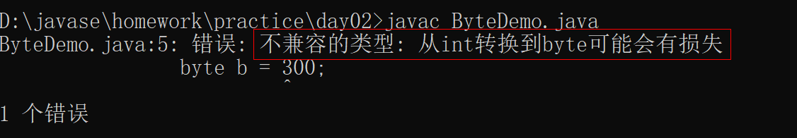

3. 解决：强制类型转换前面加上（数据类型）

   ```java
   byte b = (byte)300;
   ```

   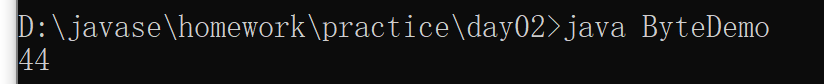

4. 需求2：给byte 类型的数赋值 128

5. 问题：超过给定数据范围，就会循环

   

## 13. 变量

定义格式：

```java
数据类型 变量名 赋值符号 数值
   int   num    =     10;
```

代码演示：

```java
public class VariableDemo{
    public static void main(String[] args){
        //定义一个3.5的变量
        double d = 3.5;
        d = 3.6;
        
    }
    
}
```

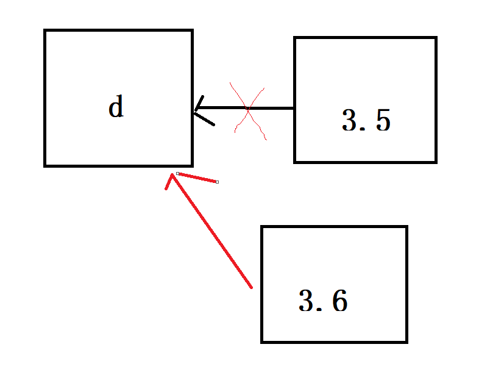

注意：程序是从上往下执行的流程，没有执行到的不管。

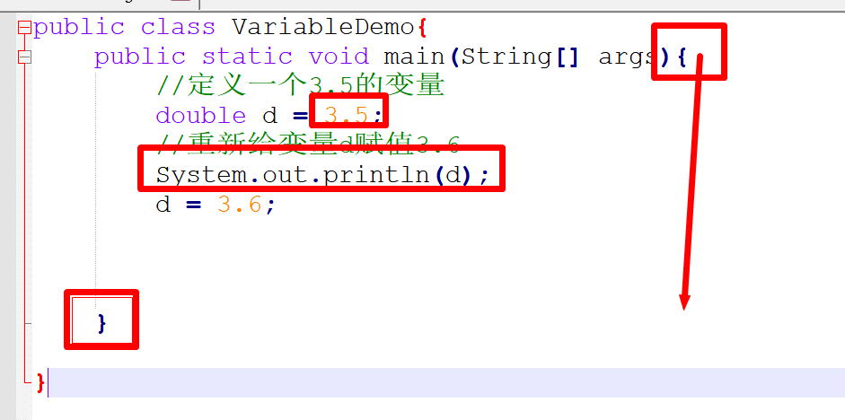

## 14. 常量

定义：永远不会变的量，10,10.3,1000L

```java
public class ConstantDemo{
    public static void main(String[] args){
        
        System.out.println(10);
    }
    
}
```

**注意**：使用 final 修饰的变量也是常量，并且不能重新赋值

```java
public class ConstantDemo{
    public static void main(String[] args){
        
        System.out.println(10);
        //之前定义的变量,前面加 final 关键字以后就变成常量
        final int num = 10;
    }
    
}
```

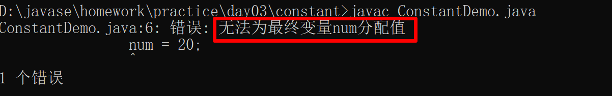

## 15. 运算符

### 15.1. 算术运算符

1. 运算符用来计算数据的，数据可以是常量，也可以是变量，被我们运算符操作的数，我们称之为操作数

2. 算术运算符+、-、*、/、%、++、--

   | 运算符 | 运算规则 |        例子         |    结果    |
   | :----: | :------: | :-----------------: | :--------: |
   |   +    |   正号   |         +10         |     10     |
   |   +    |   加法   |        10+12        |     22     |
   |   +    |  连接符  |   “名字：”+“上云”   | 名字：上云 |
   |   -    |   负号   |         -10         |    -10     |
   |   -    |   减法   |       20 - 10       |     10     |
   |   *    |   乘法   |        10*2         |     20     |
   |   /    |    除    |      6/3(5/2)       |     2      |
   |   %    |   取模   |         5%2         |     1      |
   |   ++   |   自增   | int a = 1;a++/++a;  |     2      |
   |   --   |   自减   | int b = 2; b--/--b; |     1      |

   注意：

   - 前置++ 先+1 后运算（后做操作），后置++ 先操作后+1；
   - 前置-- 变量先-1，后操作，后置-- 先操作，变量后-1；

### 15.2. 赋值运算符


1. 赋值运算符，用来为变量赋值的。=、+=、-=、*=、/=、%=

   | 运算符 |  运算规则  |            例子            | 结果 |
   | :----: | :--------: | :------------------------: | :--: |
   |   =    |  赋值符号  |        int a = 10;         |  10  |
   |   +=   |  加后赋值  | int a = 10; a+=2;(a = a+2) |  12  |
   |   -=   |  减后赋值  |     int a = 10; a-=2;      |  8   |
   |   *=   |  乘后赋值  |      int a = 10;a*=2;      |  20  |
   |   /=   |  除后赋值  |      int a = 10;a/=5;      |  2   |
   |   %=   | 取模后赋值 |      int a = 10;a%=3;      |  1   |

### 15.3. 关系运算符


1. 关系运算符又叫比较运算符，用来判断两个操作数大小关系，以及是否相等，结果是我们boolean 类型，true false 

   | 运算符 |   运算规则   | 例子  | 结果  |
   | :----: | :----------: | :---: | :---: |
   |   >    |     大于     | 5 > 3 | true  |
   |   >=   | 大于或者等于 | 5>=5  | true  |
   |   <    |     小于     |  5<3  | false |
   |   <=   |   小于等于   | 3<=4  | true  |
   |   ==   |     等于     | 3==3  | true  |
   |   !=   |    不等于    | 3!=4  | true  |

2. 注意：赋值运算的 = 和关系运算符的 == 是有区别的，= 是做赋值， == 是做判断比较。

   ```java
   int a = 5;
   int b = 10;
   System.out.println( a == b);
   System.out.println(a = b);
   ```

   

### 15.4. 拓展内容

二进制运算的原码，反码，补码(Integer.toBinaryString())

- 原码：1  00000000 00000000 00000000 00000001

- 反码 ：1 00000000 00000000 00000000 00000001

- 补码： 1 00000000 00000000 00000000 00000001

  ```java
  -1这个数的原码、反码、补码
      原码
      	10000000 00000000 00000000 00000001
      反码
      	11111111 11111111 11111111 11111110
      补码 = 反码 + 1
      	11111111 11111111 11111111 11111111
  ```


### 15.5. 逻辑运算符

1. 逻辑运算符，用与 boolean 类型的值进行运算比较的。最终结果 true 或者是 false(按住 shift + 对应符号)

   | 运算符 |        运算规则        |       例子       | 结果  |
   | :----: | :--------------------: | :--------------: | :---: |
   |   &    |     与（两者为真）     |   true & false   | false |
   |   \|   |   或(有一个真即为真)   |  true \| false   | true  |
   |   ！   |       非（取反）       |      !true       | false |
   |   ^    | 异或（两者不同即为真） |   true ^ false   | true  |
   |   &&   |         短路与         |  false && true   | false |
   |  \|\|  |         短路或         | true \|\| false  | true  |
   |   ^    |    异或做二进制运算    | 二进制无进位相加 |       |

### 15.6. 条件运算符

boolean ？ 值1：值2；

```java
true?"你好"："不好";
```


### 15.7. 位运算符

当你使用数字操作位运算符时，是使用二进制操作的。

位运算符(1=true,0=false)：

- &(与)  1&1=1,1&0=0

- |（或）1|1=1,1|0=1,0|0=0

- ^(异或) 1^1=0,1^0=1,0^0=0

- 〜(取反) ~1=0，~0=1（二进制元素位）

  ```java
  0000 0001
  1111 1110
  ```

- << （左移）左移一位相当于乘以2，右移一位相当于除以2

  ```java
  0000 0001
      <<2
  0000 0100
      
      >>1 右移
  0000 0010
      >>1
  0000 0001
  无符号右移 >>>
  
  ```

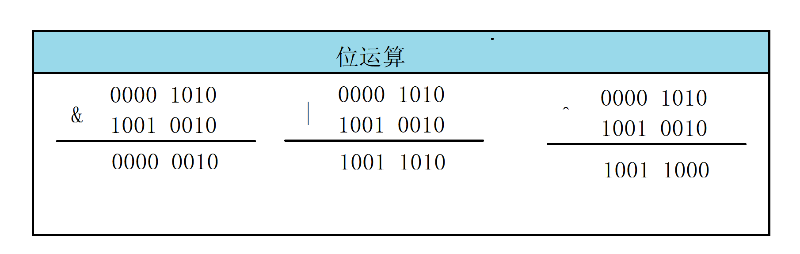

## 16. idea 的安装以及使用

1. 项目和模块之间的关系：project --> 多个模块 --->多个包 --->多个类（包用域名倒着写）www.baidu.com com.baidu
2. www.sycoder.cn  cn.sycoder
3. idea 快捷键的讲解（目前常用的）

|      说明      |          快捷键          |
| :------------: | :----------------------: |
|     主方法     |           psvm           |
|    单行注释    |         ctrl + /         |
|    多行注释    |       ctrl+shift+/       |
|    文档注释    |       /** + enter        |
|  打印输出语句  |           sout           |
|    删除一行    |         ctrl + y         |
|    复制一行    |         ctrl + d         |
|   代码格式化   |       ctrl +alt +L       |
|     重命名     |        shift + f6        |
|    多行输入    |      alt +鼠标左键       |
|    上下移动    | shift + alt + 方向上下键 |
| 自动生成变量名 |      ctrl + alt + v      |

## 17. 条件与循环语句

### 17.1. 选择结构 if

1. if 的定义

   ```java
   if(boolean){
       //如果条件是 true执行代码块
   }
   //需求 如果考试得了一百分，奖励手机
   ```

   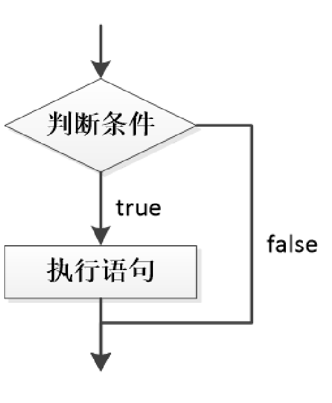

2. if...else 语句

   ```java
   //定义
   if(boolean){
       //语句块1
   }else{
       //语句块2
   }
   //如果条件满足，执行语句块1，否则执行语句块2
   
   //需求：如果考试得100奖励一个手机，否则，家庭作业翻倍
   
   ```

   

   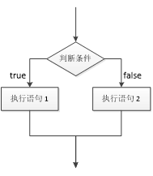

3. if ... else if... else if ...else(只选其中一条路走)

   ```java
   //语法定义
   if(boolean){
       //语句块1
   }else if(boolean){
       //语句块2
   }else if(boolean){
       //语句块3
   }else{
       //语句块4
   }
   
   //需求：考90分以上 等级A，[80-90) B  [70-80) c [0-70)d
   
   ```

   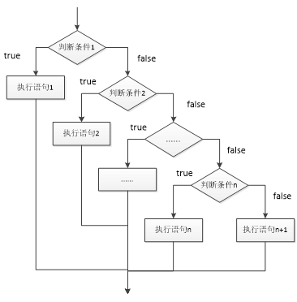

   

注意：最多只有一个分支执行，如果有 else 那一定分支执行

### 17.2. 选择结构 Switch

1. 定义

   ```java
   switch(表达式){
    case 目标值：
        执行语句
        break;
    case 目标值：
        执行语句
        break;
    case 目标值：
        执行语句
        break;
       default:
           执行语句
   }
   
   //需求：int week = 1;1 打印星期1,2打印星期2 7打印星期天
   ```

   

### 17.3. 循环结构

#### 17.3.1. while 循环

1. 循环：重复相同的步骤

   ```java
   //定义
   while(boolean){
       代码块
   }
   
   //需求1：播放音乐10次
   //需求2：定义一个变量，从0开始，当变量小于5的时候，计算变量之间的和
   ```

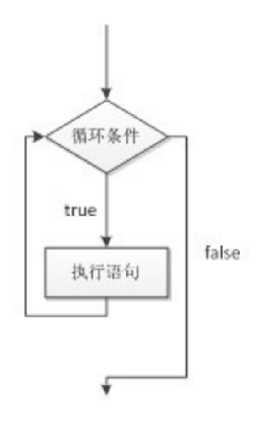

#### 17.3.2. do...while

1. 先做一次，再判断

   ```java
   do{
       语句块
   }while(boolean);
   
   //需求：不管你之前听音乐听多了多次，当我判断的时候都要一次 播放音乐<10;
   ```

   

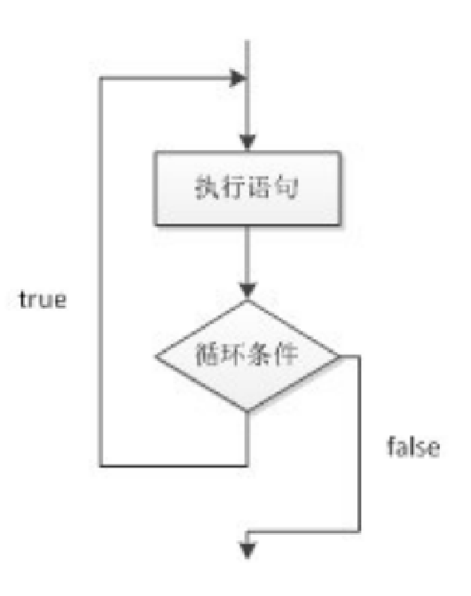

#### 17.3.3. for 循环

1. for 循环的定义

   ```java
   for(表达式1;表达式2;表达式3){
       语句
   }
   
   for(①；②；③){
    ④   
   }
   ⑤
       
   执行流程
       第一步：先执行①
       第二步：其次②
       第三步：执行④
       第四步：执行③
       第五步：回到②
       最后：  执行5
   //需求：求1-5的和
   ```

#### 17.3.4. 嵌套循环

特点：最外层的循环执行一次，里面全部执行完，再继续去执行最外层的代码。

```java
for(表达式1;表达式2;表达式3){
    for(表达式1;表达式2;表达式3){
    	语句
	}
}

//用 * 打印一个直角三角形

```


### 17.4. break

1. 在switch条件语句和循环语句中都可以使用break语句。当它出现在switch条件语句中时，作用是终止某个case并跳出switch结构。

   - 需求：定义一个变量num = 1,当num 大于10的时候，循环停止

2. 标记语法

   ```java
   可以指定break 跳转到某一层循环
   ```

   

### 17.5. continue

1. 终止本次循环，继续往下执行
   - 需求：对1~100之内的奇数求和

注意：continue 是停止本次循环，继续执行下一次循环，而break 是整体把循环结束

## 18. 数组

1. 在生活中，会遇到如下场景，需求：统计班级学生数量，计算学生的平均年龄，找出学生最老的，找出学生最小的。
   - 假如我们班有35个人，需要35个变量来表示我们学生的年龄，这样做很麻烦而且很臃肿。
2. 数组的概念：一堆数的组合。20,21,23,20
3. **数组中 length 属性，就是数组的长度**
4. 数组的索引是从 0 开始的，也就是数组的下标，最大值是数组长度 -1，也就是 length -1
5. 数组长度一但固定，就不可变

### 18.1. 数组的定义

1. 动态定义：数组初始化时，数组元素是空的，需要我们重新赋值才有数据。

   ```java
   数据类型[] 数组名称 = new 数据类型[元素个数];
   //样例
   int[] ages = new int[35];
   
   //赋值
   数组名称[对应的索引]
   ```

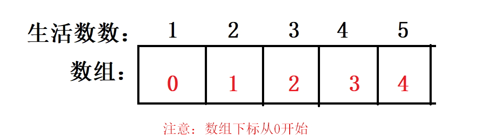

2. 静态定义：数组初始化的时候，就已经确定各索引元素的值

   ```java
   //方式1
   数据类型[] 数组名称 = new 数据类型[]{数据1,数据2，数据3};
   
   //方式2
   数据类型[] 数组名称 = {数据1,数据2，数据3};
   ```

3. 获取值，或者赋值

   ```java
   //给数组元素赋值
   数组名称[索引] = 值；
   //获取值
   数组类型 变量名 = 数组名称[索引];
   ```

   - length:数组的长度
   - 索引：从0开始，比length 少1

### 18.2. 数组的遍历

1. 再操作数组时，经常需要去拿元素取元素，这种操作就是数组的遍历。

2. 遍历的语法

   ```java
   //for 循环 快捷键 fori
   for(int i =0;i<arr.length; i++){
       
   }
   //foreach 遍历
   数组变量名.iter
   for(数据类型 变量名:数组名称){
       
   }
   
   ```

3. foreach 底层其实还是使用我们的for 循环

### 18.3. 数组的特点

1. 常见问题

   - 索引越界异常（没有再索引范围内）

     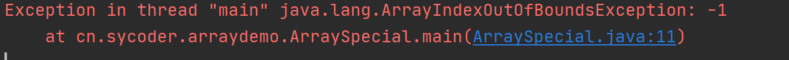

   - 数组未初始化

     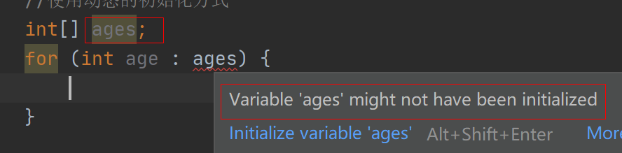

   - 空指针异常

     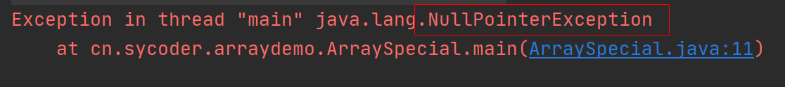

2. 数组元素存储的特点

   - 数组的元素数据类型必须一致（char 有 ASII码表对应）

   - 数组元素连续，空间大小一致，并且内存地址连续，呈现线性结构

   - 数组长度固定之后，不可改变

   - 数组不仅可以存储基本数据类型，还可以存储引用数据类型，数组本身就是引用数据类型

     ```java
     String[] strs = {"1","2","3"};
     ```

3. 优缺点

   - 优点
     - 根据索引去获取访问元素（快）
     - 能存储较多的数据
   - 缺点
     - 数组的长度固定，不可改变（超过容量增加数组元素时，只能用新数组代替）
     - 只能存储一种数据类型
     - 删除很慢，根据内容找索引很慢

### 18.4. 数组的拷贝及其扩容

1. 需求：原数组不够放，新增加了元素，只能考虑扩容和拷贝

   ```java
    //原来5个同学的年龄
   int[] ages = {12,13,21,19,23};
   
   //新加入一个同学 18；
   int[] newAges = new int[ages.length + 1];
   for (int i = 0; i < ages.length; i++) {
       newAges[i] = ages[i];
   }
   newAges[newAges.length - 1] = 18;
   for (int newAge : newAges) {
       System.out.println(newAge);
   }
   ```

   

2. 需求2：从源数组某一个位置开始拷贝，拷贝某一个长度到目标数组里面去

   ```java
   //从源数组的第2个元素，拷贝3个元素到新数组里面去
    //需求2的实现13,21,19
   int[] ages2 = {12,13,21,19,23};
   int[] newAges2 = new int[3];
   //第二个元素
   int srcPos = 1;
   //拷贝多长
   int index = 3;
   //目标数组的起始位置
   int destPos = 0;
   for (int i = srcPos; i < srcPos + index; i++) {
       //新数组从 destPos 开始拷贝，每次递增
       newAges2[destPos++] = ages2[i];
   }
   System.out.println("-----");
   for (int newAge : newAges2) {
       System.out.println(newAge);
   }
   ```

   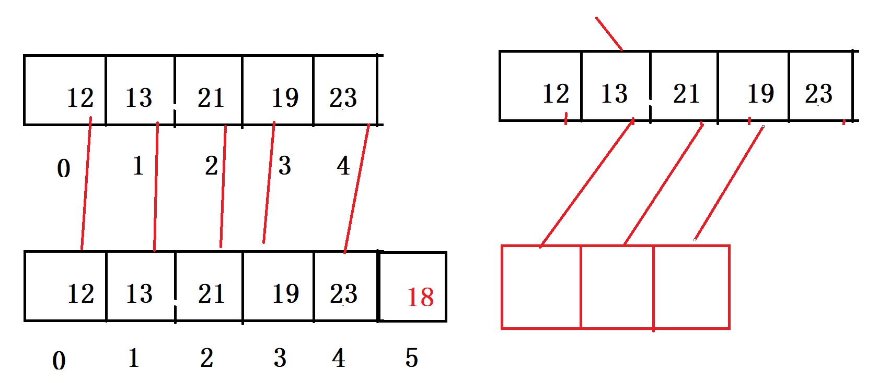

### 18.5. 数组的工具类 Arrays 简单了解

1. 需求：int[] ages = {1,3,4,5,6}; 打印输出的时候，[1,3,4,5,6];

   ```java
   int[] ages = {1, 3, 4, 5, 6};
   //最后字符串结果
   String ret = "[";
   for (int i = 0; i < ages.length; i++) {
       //如果当前元素是最后一个元素，就不添加,
       if (i == ages.length - 1) {
           ret += ages[i] +"]";
       } else {
           ret += ages[i] + ",";
       }
   
   //            ret += i == ages.length - 1?ages[i] +"]":ages[i] + ",";
   }
   System.out.println(ret);
   ```

2. Arrays工具类

   ```java
   int iMax = ages.length - 1;
   String str = "[";
   for (int i = 0; ; i++) {
       str += ages[i];
       if(i == iMax){
           str+="]";
           break;
       }
       str+=", ";
   }
   ```

   

### 18.6. 二维数组

定义：二维数组，就是数组中有数组

```java
//一维数组
int[] arr = new int[10];
//动态定义
int[][] arr2 = new int[2][3];
//静态定义
int[][] arrays = new int[][]{{1,2,3},{4,5}};
int[][] arrays = {{1,2,3},{1,4}};

```

遍历：第一层拿到里面的数组元素（数组），第二层拿到具体的值

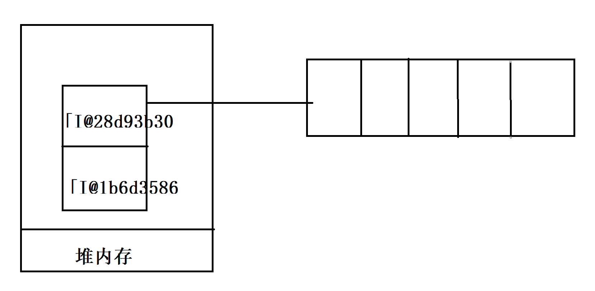

## 19. 简单算法

1. 元素位置交换，需求：定义两个变量，交换两个变量的值

   ```java
   //方式1中间变量
   int a = 10;
   int b = 20;
   int temp = a;
   a = b;
   b = temp;
   
   //方式2不使用中间变量
   int c = 2;
   int d = 3;
   c = c^d;
   d = c^d;
   c = c^d;
   ```

### 19.1. 冒泡排序

1. 做相邻比较

```
public static void main(String[] args) {
        int[] heights = {9, 2, 6, 7, 4, 1};
        //第几轮比较
        for (int i = 0; i < heights.length - 1; i++) {

            //相邻比较
            for (int j = 0; j < heights.length - 1 - i; j++) {
                //做交换
                if (heights[j] > heights[j + 1]) {
                    heights[j]^=heights[j+1];
                    heights[j+1]^=heights[j];
                    heights[j]^=heights[j+1];
                }
            }

        }

        System.out.println(Arrays.toString(heights));
    }
```

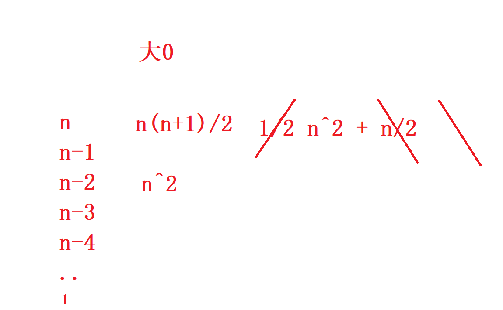

### 19.2. 选择排序

```java
public static void main(String[] args) {
        int[] heights = {9, 2, 6, 7, 4, 1};
        //最外层控制找到的最小元素
        for (int i = 0; i < heights.length - 1; i++) {
            //定义一个元素，不停的去找最小值
//            for (int j = i; j < heights.length - 1; j++) {
//                if (heights[i] > heights[j+1]){
//                    heights[i]^=heights[j+1];
//                    heights[j+1]^=heights[i];
//                    heights[i]^=heights[j+1];
//                }
//            }
            for (int j = i + 1; j < heights.length; j++) {
                if (heights[i] > heights[j]) {
                    heights[i] ^= heights[j];
                    heights[j] ^= heights[i];
                    heights[i] ^= heights[j];
                }
            }
        }
        System.out.println(Arrays.toString(heights));
    }
```

### 19.3. 二分查找法

1. 要求：要求数组元素是有序的

   ```java
   public static void main(String[] args) {
           int[] arr = {1, 2, 3, 5, 6, 8, 9, 11, 12, 16};
           //目标寻找的数
           int num = 16;
           //从哪开始找（索引位置）
           int min = 0;
           //到哪结束（索引位置）
           int max = arr.length - 1;
   
           while (min <= max) {
               System.out.println("min: " + min);
               System.out.println("max: " + max);
               //找一半
               int mid = (min + max) >> 1;
               //中间元素的值
               int midValue = arr[mid];
               if (midValue < num) {
                   min = mid + 1;
               } else if (midValue > num) {
                   max = mid - 1;
               } else {
                   System.out.println("找到了，当前元素的位置是：" + mid);
                   break;
               }
           }
   
   
       }
   ```

   

## 20. 方法

1. 生活中的方法：处理某件事或者解决某个问题的办法。

2. java中的方法：用来解决某件事情或者实现某个功能的办法。

   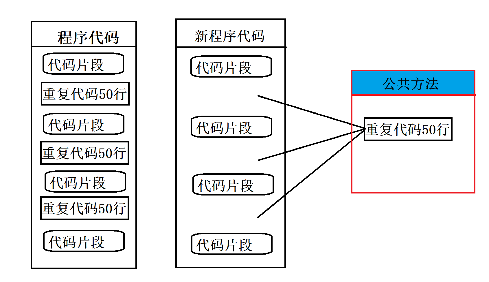

3. 方法的定义

   ```java
   修饰符 返回值类型 方法名(形式参数){
       方法体
   }
   //实现从老代码迭代成新代码
   //修饰符      方法无返回   方法名   参数列表
   public static void      print(String str) {
           
   }
   ```

4. 带返回类型的方法定义

   ```java
   修饰符 返回值类型 方法名(形式参数){
       方法体
           
       return 返回值类型;
   }
   ```

5. return 的作用：结束当前的方法，可以单独用，还可以带返回类型用

6. **返回类型**：

   - 八大基本数据类型 
   - 引用数据类型
   - void(没有返回)

7. 需求：定义加法计算器，带两个参数的，方法返回类型为 int

   ```java
   public static int add(int num1,int num2){
           int ret = num1 + num2;
           return ret;
   }
   ```

8. 需求：求5个数的和，返回类型 int

   ```java
    public static int addSum(int... nums) {
           int sum = 0;
           for (int num : nums) {
               sum += num;
           }
           return sum;
       }
   ```

9. 注意：方法的可变参数底层实际上就是数组

   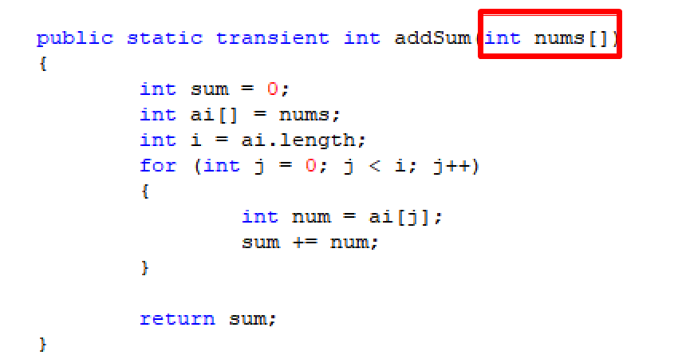

### 20.1. 🔴方法的重载

1. 需求1.0：

   - 定义一个求浮点型 double 的计算器
   - 定义方法分别去求 float 计算器
   - 定义方法分别去求 short 计算器
   - 定义方法区求 String 字符串的拼接

2. 需求2.0

   - 定义打印 String 类型的字符串方法
   - 定义打印 int 类型的方法

3. 方法的重载：

   - 定义：同一个类里面，方法允许存在一个以上的同名方法，要求参数列表不同
   - 参数列表不同：
     - 1.参数类型不同
     - 2.参数顺序不同
     - 3.参数个数不同
   - 和返回值类型无关

   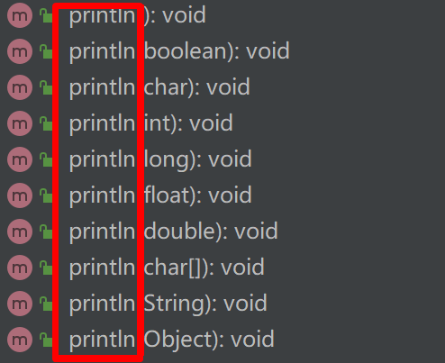

### 20.2. JVM内存模型变化

1. 栈：是线程私有的，生命周期与线程相同，线程之间不共享，里面拥有多个栈帧
   - 局部变量
     - 方法内定义的局部变量
     - 参数列表变量
     - 对象引用（指向对象的引用地址）指向堆里面
   - 栈是一块连续的空间，相对于堆来说，内存较小，运行速度较快，不需要垃圾回收机制
2. 堆：是jvm 内存模型最大的一块，被所有共享，在jvm 启动时所创建。
   - 存放对象实例（new 对象）并且会给初始值
   - 需要垃圾回收机制回收垃圾，
   - 配置大小：-Xmx -Xms
   - 如果堆中的对象没有被栈引用时，会被垃圾回收器不定时回收。
3. **字符串常量池**：存储在类加载完成，经过验证，解析阶段的一些常量字符串。
4. 程序计数器pc:
   - 是一块很小的内存区域，记录当前线程执行的字节码的行号指示器，可以去通过计数器控制，指令，循环，跳转。
   - 线程私有，每条线程都有自己的程序计数器
5. 方法区：
   - 类信息，记录类的字节码信息，常量池（String 和 包装类）
6. GC（垃圾回收器）：不定时的回收垃圾，回收一些没有引用的堆内存的垃圾，不需要程序员手动操作。

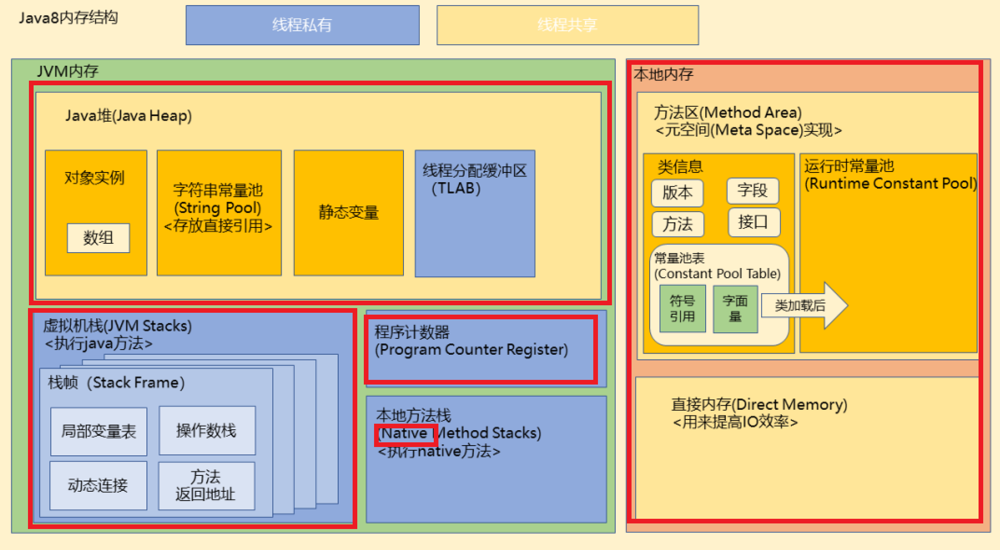

### 20.3. jvm方法执行内存模型变化

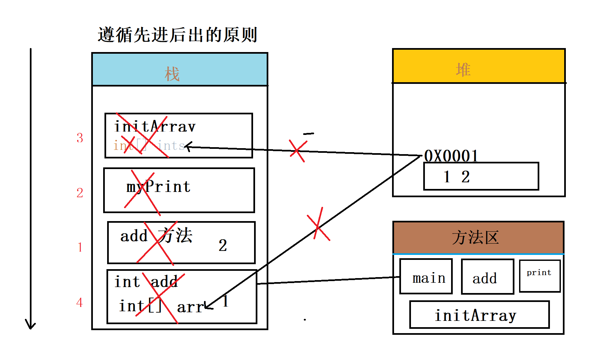

### 20.4. 方法的递归

1. 定义：方法自己调用自己

2. 需求：

   - 不使用递归计算 5 的阶乘

     ```java
     int num = 5;
     int ret = 1;
     for (int i = 0; i < 5; i++) {
         ret *= num--;
     }
     System.out.println(ret);
     ```

   - 使用递归计算5的阶乘

     ```java
     public static int recursion(int num) {
         if (num == 1) {
             return 1;
         }
         int recursion = recursion(num - 1);
         int ret = num * recursion;
         return ret;
     }
     ```

     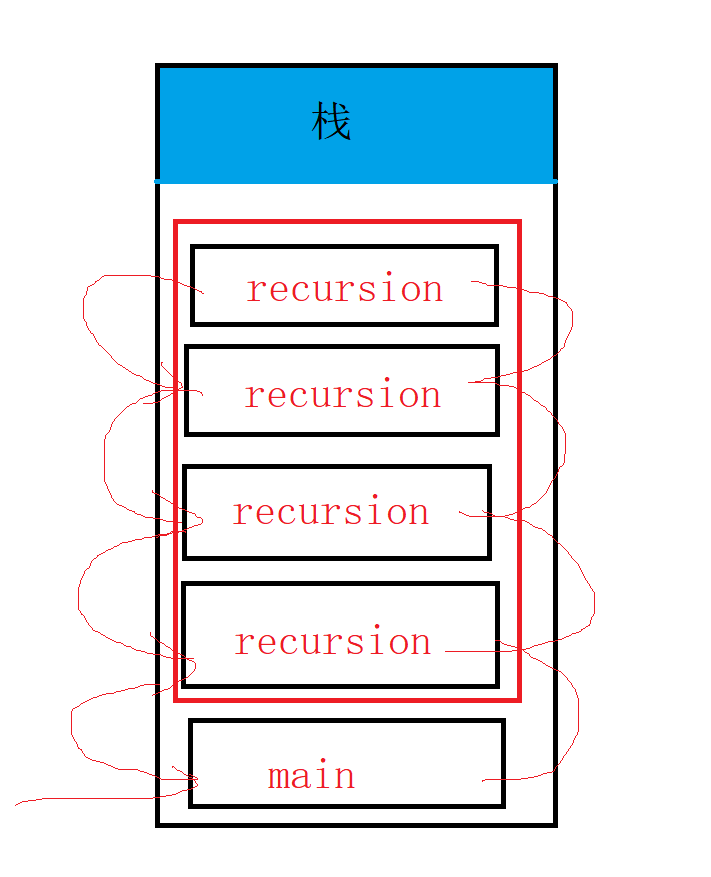

## 21. 软件设计的概况

1. 软件的生命周期
   - 产品提出需求
   - 分析以及规划
   - 软件编码及其调试（自测，联调）
   - 上测试环境，给测试人员测试（提bug）
   - 上 linux 生产服务器（运维人员维护，修改bug，系统的升级迭代）
   - 被弃用
2. 软件设计原则
   - 可重用性（减少重复的代码）
   - 可拓展性
   - 可维护性
   - 高内聚、低耦合（模块之间要相互独立）

## 22. 面向过程

1. 面向过程：（Procedure Oriented Programming）pop是流程性的执行，需要去处理方法与方法之间的关系，或者是方法的调用
2. 存在问题：从上往下设计的方式，分别考虑每个方法干啥，细分很难。
3. 需求：做饭（买菜，做饭，做菜，吃饭，洗碗）

## 23. 面向对象

1. 面向对象：（Object Oriented Programming ）OOP ,站在对象的角度去考虑问题（处理类和类之间的调用和操作，把每一个类，拆分成不同的功能）
2. 面向对象三大特征：
   - 封装：（可以把功能的特征的一些事物封装成一个对象，可以将细节隐藏起来，通过公共方法来调用，暴露功能）
   - 继承：做到代码的复用
   - 多态：把子类赋值给父类对象，调用的时候，还是去调用子类，表现出不同的特征
3. **类：**具有相同特征和行为的事物进行一个抽象。
   - 电脑：cpu、内存、电源、主板
   - 人：名字，身高，体重
4. 对象：是类的实例，类是对象的模板。

面向对象和面向过程的区别：

- 面向过程会更平面化
- 面向对象会更加立体
- 你中有我，我中有你
- 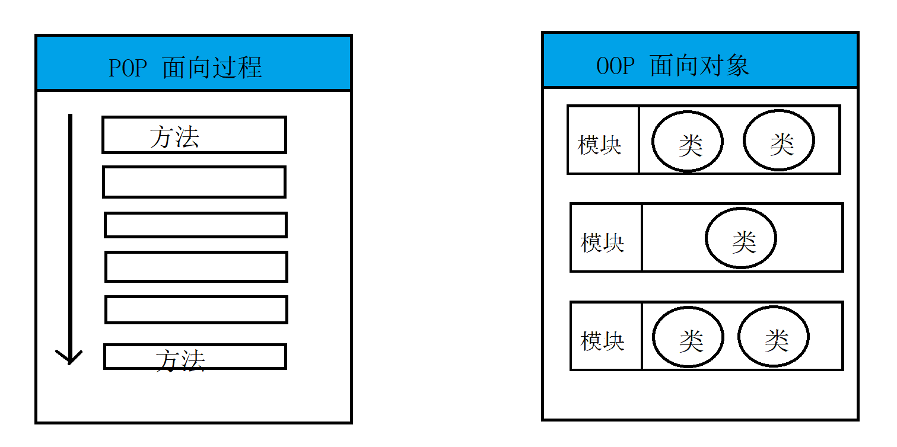

### 23.1. 类的定义

1. 成员变量（字段）

2. 方法

3. 定义格式

   ```java
   public class 类名{
   	0-N个字段（成员变量）
       
          
       0-N个方法;
       
   }
   ```


### 23.2. 对象的创建和使用

1. 创建方式 **类名 类变量名 = new 类名();**

   ```java
   Student stu = new Student();
   ```

2. 给对象成员变量设置值 **类变量名.字段名=值**

   ```java
   student.name="上云";
   ```

3. 获取成员变量的值,**数据类型 变量名 = 类变量名.字段名**

   ```java
   String name = student.name;
   ```

4. 实例方法的调用，**类对象名.方法名**

   ```java
   student.showInfo();
   ```

   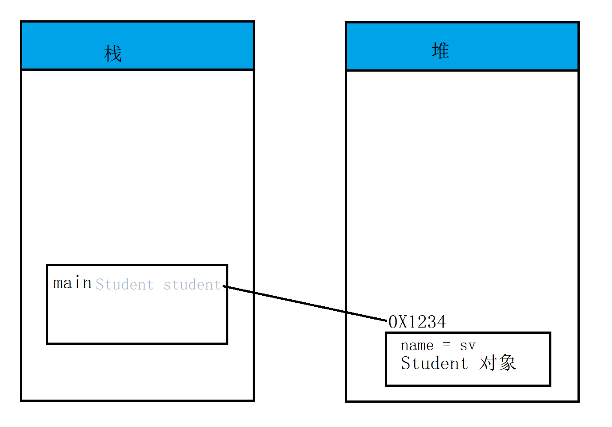

### 23.3. 构造方法

1. 也叫构造器（构造方法），是用来创建对象的，当你创建对象时，一定执行

2. 构造方法：

   - 也有修饰符
   - 不具备方法的返回值类型
   - 可以带参数
   - 默认的构造方法，里面没有任何内容
   - 构造方法可以重载

3. 构造方法，创建对象时，可以传参

   ```java
   Book book = new Book("E3层");
   ```

4. 注意：不提供构造方法时，默认提供一个不带参数的构造器

### 23.4. 实例方法

1. 定义方式：

   - 具有修饰类型
   - 有返回值类型
   - 有方法名和参数列表

2. 定义：

   ```
   修饰符 返回值类型 方法名（参数列表）{
   
   }
   ```

3. 调用方式，使用对象调用。

   ```java
   对象变量名.方法名
   ```

4. 空指针异常（没有去创建对象，就是调用对象的属性或者是方法）

   

### 23.5. 导包

1. 如果存在重名的情况，需要去选择自己的包 alt + enter

## 24. static 关键字

1. **static**：是一个修饰符，表示静态的，可以用来修饰，方法、字段、代码块、内部类，最优先加载进内存的。

2. 注意：

   - static 关键字，表示该资源属于类（而不是属于类对象）。只要使用 static 修饰的，直接使用类名.来调用，

     不用创建对象

     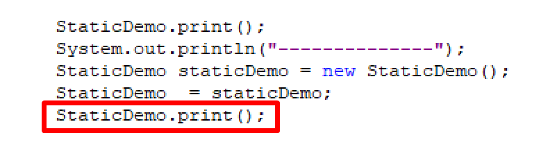

   - 在非 static 方法中，可以去访问 static 方法，但是最好用类名.来调用。

   - 在 static 方法中，不能直接访问普通方法

   - 静态代码块优先于一切先执行

     ```java
     static {
         System.out.println("static 修饰的代码块");
     }
     ```

3. 什么时候使用 static 修饰的字段以及方法和代码块

   - 在开发中，写工具类的时候。
   - 资源加载，加载配置文件（mysql jdbc）

## 25. 深入变量

变量的定义语法：

```java
数据类型 变量名 = 值；
```

根据位置不同，分为两大类：

1. 成员变量
   - 类成员变量（类名.字段名调用）
     - 生命周期：从类加载到程序结束
     - 使用 static 修饰的，直接定义到类里面的
   - 实例成员变量
     - 生命周期：从创建对象开始到GC垃圾回收器回收垃圾结束
     - 直接定义到类里面的
2. 局部变量
   - 生命周期：从变量定义开始，到最近的花括号结束}
   - 方法内部的变量
   - 参数列表
   - 代码块里面的变量
3. 什么时候使用成员变量，什么时候使用局部变量？
   - 考虑变量的生存时间（影响内存的开销）
   - 能减少作用域都去减少（减少内存开销）
   - 定义工具类时（static 用起来比较方便）成员变量封装好，利于我们方法使用


## 26. 封装

1. 没有封装会有什么问题

   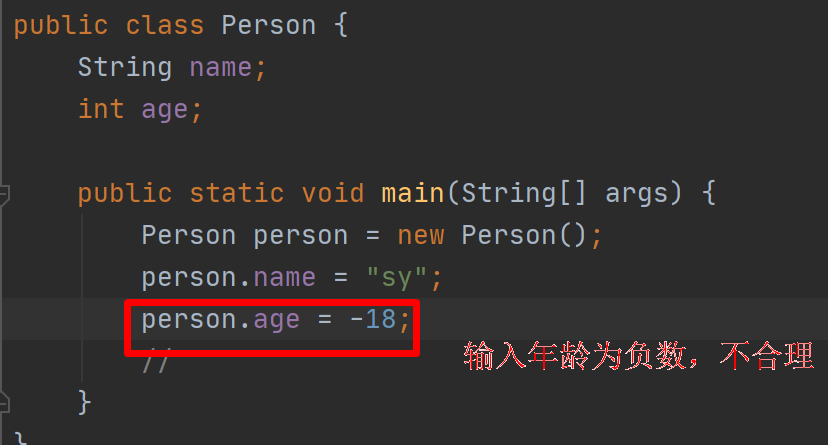

2. 是用封装，做到了信息隐藏。

   

3. 什么是封装？

   - 把对象的状态和行为看成了一个统一的整体，放到一个独立的模块中（类）
   - 做到信息隐藏，把不需要外界看到的信息隐藏起来（private进行私有化），**向外提供方法**，保证外界的安全访问。

4. 封装的好处和意义：

   - 提供了代码的复用性（可以减少重复代码）
   - 使用者可以正确操作，方便使用系统功能
   - 把实现细节隐藏起来，提供了安全性

## 27. 访问控制权限修饰符

1. 封装的目的，有些类让另一些类看不到里面再做什么事情，所以提供了访问控制权限修饰符来解决。

2. 访问权限修饰符

   |  修饰符   | 类内部 | 同一个包 | 子类 | 任何地方 |
   | :-------: | :----: | :------: | :--: | :------: |
   |  public   |   √    |    √     |  √   |    √     |
   | protected |   √    |    √     |  √   |          |
   |   缺省    |   √    |    √     |      |          |
   |  private  |   √    |          |      |          |

   

## 28. 封装的实现

1. 规范

   - 遵循 javabean 规范

     - set 后面的单词采用驼峰命名法，并且使用原单词 setAge(...)

     - get getAge();

       ```java
       private int age;
       
       public void setAge(int a){
           age = a;
       }
       
       public int getAge(){
           return age;
       }
       ```

   - 变量：就近原则

   - this 关键字：代表当前对象的引用

   - 需求：建一个学生类，name ,age,address 提供set get 方法。

     ```java
     public class Student {
     
         private String name;
     
         private int age;
     
         private String address;
     
         public Student(){
     
         }
     
         public Student(String name){
             this.name = name;
         }
     
         public void setName(String name){
             this.name = name;
         }
     
         public String getName(){
             return name;
         }
     
         public void setAge(int age){
             this.age = age;
         }
     
         public int getAge(){
             return age;
         }
     
         public void setAddress(String address){
             System.out.println(this);
             this.address = address;
         }
     
         public String getAddress(){
             return address;
         }
     }
     ```

2. 对于私有属性传参

   - 使用 set get
   - 使用构造器

3. 注意：

   - static 静态的不能使用this 关键字，默认get 如果你不写 this,底层也会给我们加上 this
   - this 关键字也可以再构造器里面使用


## 29. 引出继承

父类：存储共性（状态，行为）

子类：存放自己的特性

继承的作用：代码复用

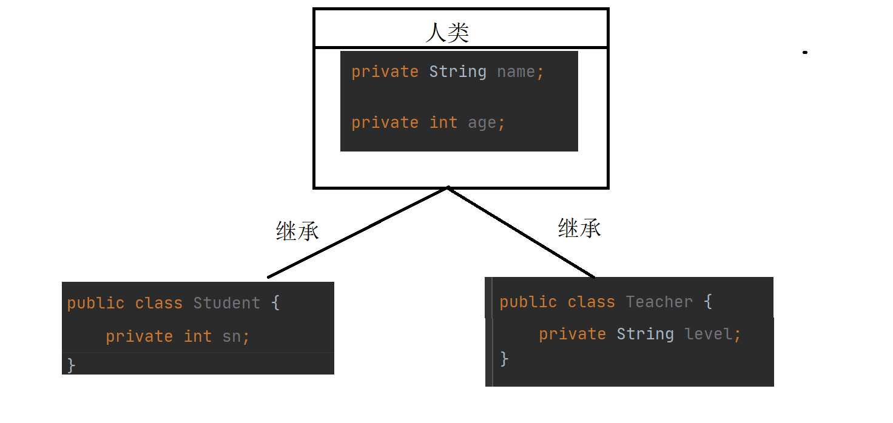

## 30. 继承思想

定义：基于某个父类对其进行拓展，定义新的子类，子类可以继承父类原来的属性和行为，并且可以增加父类没有的特性，或者覆盖父类中的某些特性

继承关系：is a 用是造句

继承的基础语法：

```java
使用 extends 关键字
    
public class 子类类名 extends 父类类名{
    写自己的特征
}
```

注意：

- java 只支持单继承，允许多重继承（一个类只能有一个直接父类，但是可以有多个间接父类）
- 任何类都是 Object 的子类


创建对象时，构造方法如何执行

- 先执行父类构造器（先执行父类静态代码块，再执行子类静态代码块）
- 子类构造器
- set get 方法
- 创建对象时，创建的是谁，打印 this 对象就是谁（多态）

### 30.1. 重写🔴

1. 重写：当父类特征不能满足子类特征的时候，可以对父类的方法进行重写
2. 要求：
   - 子类的访问修饰符 >= 父类本身
   - 父类不能使用 private 修饰
   - 方法返回类型，子类 <= 父类

### 30.2. 🔴重写和重载的区别

1. 没有任何关系，只不过因为名字看起来相同，所以就拿来对比

2. 重载：发生在同一个类中，方法名相同，参数列表不同，和方法的返回类型无关

3. 重写：override

4. 重载：overload

   - 重载：解决了一个类中，相同功能方法名不同的问题
   - 重写：解决子类继承父类，父类方法满足不了子类要求时，需要在子类里面重写

   

## 31. 抽象类

1. 需求：求圆（Circle）,矩形（Rectangle）的面积
2. 使用 abstract 关键字修饰，并且没有方法体
   - 必须使用 abstract 关键字修饰，方法没有方法体，留给子类去实现/重写
   - 不能使用 private 以及 static  和 final
   - 抽象方法必须定义到抽象类中或者接口
3. 使用 abstract 修饰的类特点：
   - 不能实例化
   - 抽象类可以有普通的方法
   - 抽象类构造器不能够私有化
   - 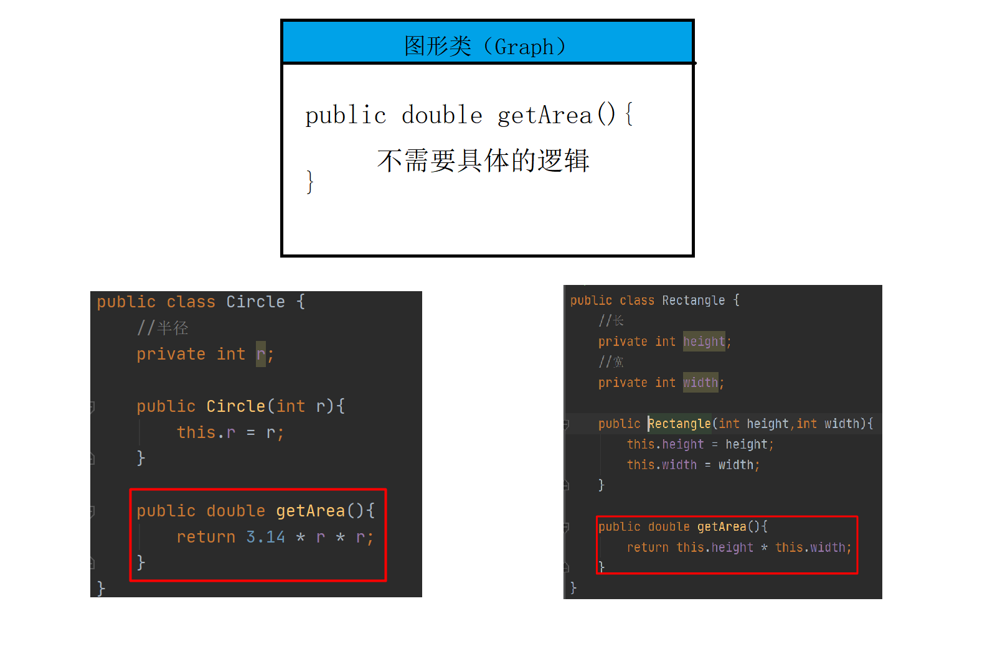

## 32. 接口

1. 什么是接口

   - 硬件接口：两个设备之间的连接方式，包含数据传输协议
     - type-c，usb，耳机接口
   - 软件接口：程序代码，是一种规范

   统一接口后的意义：根据规范设计产品，可以做到适配性。

   - 买鼠标不会去关心是哪家厂商的，是什么接口

## 33. JAVA 接口

1. 定义：使用 interface 关键字

   ```java
   //使用 interface 代替传统的 class
   public interface 类名{
       //都是抽象方法
       void usb();
       //定义常量
       public static final int EANBLE = 1;
   }
   ```

2. 注意：

   - 接口里面只能去定义抽象方法

   - 抽象方法默认提供了 public abstract 修饰符

     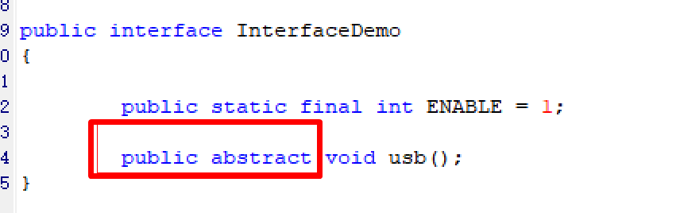

   - 接口不能实例化（和抽象类一样）

     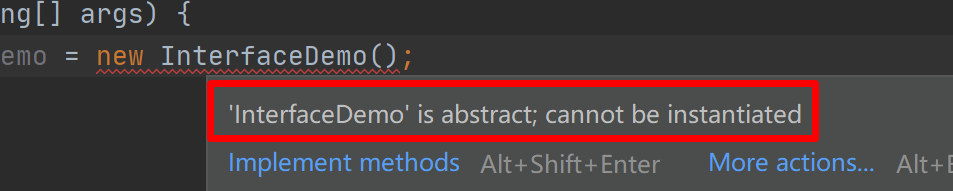

3. 接口怎么去实现

   - 使用 implements 关键字

     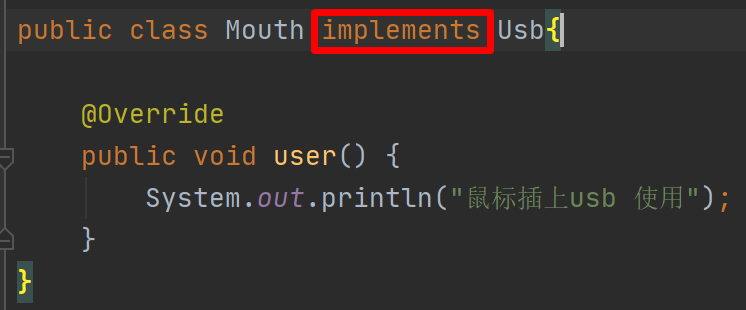

4. 接口支持多实现，分别把每个接口的抽象方法都去实现了。

   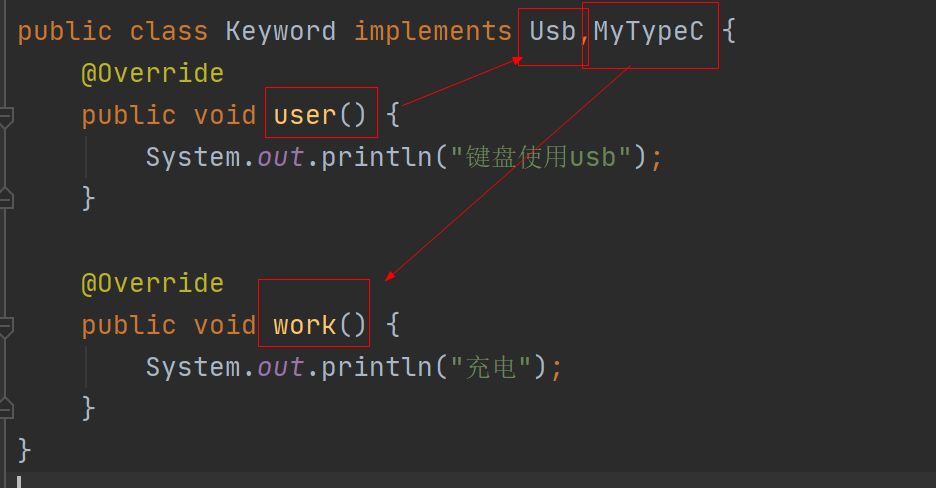

   

5. 接口的多继承

   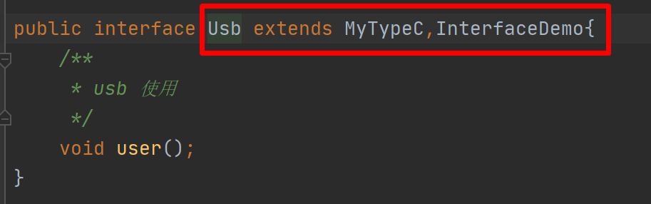

### 33.1. 抽象类和接口怎么选择

1. 都可以使用
   - 如果你不需要具体的实现时，就用接口。
   - 如果说你除了定义规范还有一定的功能，你就用抽象类

## 34. 模板方法设计模式

1. 需求：统计不同操作的时间用时。
   - 使用 String 拼接一万次
   - 使用 int 累加 一万次
