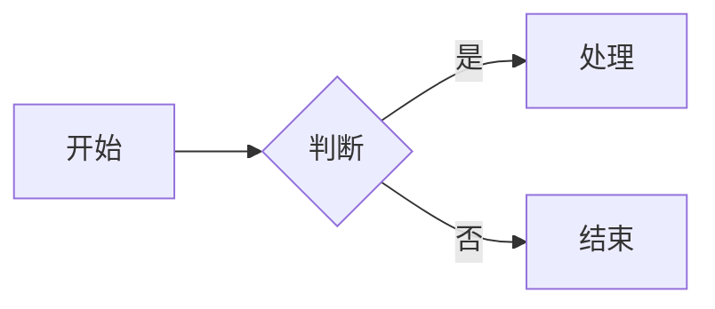

# 组件使用说明

本站 Markdown 支持 **Obsidian 双链嵌入**、**Callout 提示块** 与少量 **Vue 组件标签**。资源文件统一放在 `docs/` 下，与当前文档同级目录组织。

## 资源目录约定

与某篇文档 `docs/章节/文章.md` 同级的资源目录：

```
docs/章节/
├── 文章.md
├── img/          ← 图片（png、jpg、gif、webp、svg 等）
├── excel/        ← 表格（xlsx、xlsm、xls）
└── files/        ← 附件（pdf、视频、音频、zip、doc 等）
```

示例：本文位于 `docs/网址工具等/组件使用.md`，则图片放 `docs/网址工具等/img/`，表格放 `docs/网址工具等/excel/`，PDF 等附件放 `docs/网址工具等/files/`。

开发时资源直接从 `docs/` 读取；构建时会复制到发布目录，**无需**放到 `public/`。

启动或构建前会自动校验资源（空文件、无效 xlsx 会在终端警告；CI 环境下会导致构建失败）。

---

## Obsidian 双链语法总览

| 写法 | 解析为 | 说明 |
|------|--------|------|
| `![[file.png]]` | 图片 | 同级 `img/` |
| `![[file.xlsx\|Sheet]]` | 表格 | 同级 `excel/`，`\|` 后为工作表名 |
| `![[file.pdf]]` | PDF 嵌入 | 同级 `files/` |
| `![[clip.mp4\|说明]]` | 视频 | 同级 `files/` |
| `![[audio.mp3]]` | 音频 | 同级 `files/` |
| `![[archive.zip\|下载包]]` | 附件链接 | 同级 `files/` |
| `[[其他文章]]` | 站内链接 | 同目录或 `docs/` 下的 `.md` 页面 |
| `[[file.xlsx\|Sheet]]` | 表格 | 链接式，效果同嵌入 |
| `[[file.zip]]` | 附件下载 | 链接式 |

不支持在 Markdown 中手写 `<tableUtils urls='...'>` 或 `<imgUtils urls='...'>`，请统一使用 Obsidian 语法。

---

## Callout 提示块

Obsidian 风格的 `> [!type]` 会在构建时转换为 VitePress 容器：

| Obsidian | VitePress |
|----------|-----------|
| `[!note]` `[!tip]` `[!success]` | `::: tip` |
| `[!info]` `[!abstract]` `[!question]` | `::: info` |
| `[!warning]` `[!caution]` | `::: warning` |
| `[!danger]` `[!error]` `[!bug]` `[!failure]` | `::: danger` |

::: details 示例代码
```markdown
> [!note] 提示标题
> 正文内容，可多行。
> 每行以 `>` 开头。
```
:::

> [!note] 提示示例
> 这是 Obsidian Callout 转换后的效果，与 VitePress 主题样式一致。

---

## 图片 `imgUtils`

使用 Obsidian 嵌入语法，自动解析为 `imgUtils` 组件。

| 写法 | 说明 |
|------|------|
| `![[截图.png]]` | 显示 `img/截图.png` |
| `![[截图.png\|说明文字]]` | 同上，自定义 alt 文本 |

::: details 示例代码
```markdown
![[Pasted image 20260627153332.png]]
![[logo.png|站点图标]]
```
:::

![[Pasted image 20260627153332.png]]

- 点击图片打开 **灯箱** 大图预览，按 `Esc` 关闭
- `\|` 后文字与文件名不同时，显示为图注
- 支持中文路径与文件名
- 加载失败时显示错误提示

---

## 表格 `tableUtils`

使用 Obsidian 语法引用 **当前文档同级** `excel/` 下的 xlsx 文件。

| 写法 | 说明 |
|------|------|
| `![[dummy.xlsx\|Motor-42]]` | 嵌入表格，指定工作表名 |
| `![[dummy.xlsx]]` | 嵌入表格，未指定时尝试匹配或取第一个工作表 |
| `[[dummy.xlsx\|Motor-42]]` | 链接式写法，效果同上 |
| `[[dummy.xlsx]]` | 链接式，未指定工作表名 |

::: details 示例代码
```markdown
![[dummy.xlsx|Motor-42]]
[[learnJava.xlsx|spring]]
```
:::

![[dummy.xlsx|Motor-42]]

注意：

- xlsx 文件须为有效文件（不能是 0 字节空文件）
- `\|` 后为 **Excel 工作表名称**（Sheet Name），不是文件名
- 工作簿含多个工作表时，表格上方会出现 **下拉切换**
- 工具栏支持 **搜索**、**列头排序**（点击表头）、**导出 CSV**、**放大查看**
- 点击「放大」进入全屏模式，支持 **缩放**（50%–200%）、`Ctrl`+滚轮缩放，按 `Esc` 关闭
- URL 类单元格自动渲染为可点击链接
- 单元格内支持 Obsidian 双链语法（相对当前表格所在章节的 `docs/` 路径解析）：

| 单元格写法 | 跳转目标 |
|------------|----------|
| `[[https://example.com\|说明]]` | 外部网址（新窗口），显示 **跳转** |
| `[[example.com]]` | 自动补全为 `https://` 打开，显示 **跳转** |
| `[[组件使用]]` / `[[章节/文章]]` | 站内文档页，显示 **跳转** |
| `![[组件使用\|查看说明]]` | 站内文档页 |
| `![[资料.pdf]]` / `![[截图.png]]` | 同级 `files/`、`img/` 等资源 |
| `![[other.xlsx\|Sheet]]` | 同级 `excel/` 表格文件 |
- 首列 **固定**，便于横向滚动浏览宽表

---

## PDF `pdfUtils`

| 写法 | 说明 |
|------|------|
| `![[文档.pdf]]` | 内嵌 PDF 预览 |
| `![[文档.pdf\|标题]]` | 内嵌并显示标题 |

文件放在同级 `files/` 目录。加载失败时提供「在新窗口打开」链接。

---

## 音视频 `mediaUtils`

| 写法 | 说明 |
|------|------|
| `![[demo.mp4]]` | 视频播放器 |
| `![[demo.mp4\|演示说明]]` | 视频 + 图注 |
| `![[bgm.mp3]]` | 音频播放器 |

支持 mp4、webm、mov、mp3、wav、m4a、flac 等，文件放在 `files/`。

---

## 附件下载 `attachUtils`

| 写法 | 说明 |
|------|------|
| `![[资料.zip]]` | 嵌入下载按钮 |
| `[[资料.zip\|点击下载]]` | 链接式，自定义按钮文字 |

支持 zip、rar、7z、doc、docx、ppt、pptx 等，文件放在 `files/`。

---

## 站内页面链接

同目录或其他章节的 Markdown 页面可用双链引用：

| 写法 | 说明 |
|------|------|
| `[[组件使用]]` | 链接到同目录下的 `组件使用.md` |
| `[[其他章节/文章]]` | 链接到 `docs/其他章节/文章.md` |
| `[[文章\|显示文字]]` | 自定义链接文字 |

[[工具快捷键|工具快捷键说明]]

---

## 矢量图 `svgUtils`

在 Markdown 中直接使用 Vue 组件标签，将 SVG 代码放在组件内部。

::: details 示例代码
```html
<svgUtils>
  <svg xmlns="http://www.w3.org/2000/svg" width="400" height="200" viewBox="0 0 400 200">
    <rect x="10" y="10" width="120" height="40" fill="#fff" stroke="#000"/>
    <text x="30" y="35">示例</text>
  </svg>
</svgUtils>
```
:::

<svgUtils>
  <svg xmlns="http://www.w3.org/2000/svg" width="400" height="120" viewBox="0 0 400 120">
    <rect x="10" y="10" width="120" height="40" rx="6" fill="#fff" stroke="#333"/>
    <rect x="160" y="10" width="120" height="40" rx="6" fill="#fff" stroke="#333"/>
    <line x1="130" y1="30" x2="160" y2="30" stroke="#333"/>
    <text x="42" y="36" font-size="14">步骤 A</text>
    <text x="192" y="36" font-size="14">步骤 B</text>
  </svg>
</svgUtils>

- 工具栏：**缩小 / 放大 / 重置**；点击 **放大** 进入页内全屏（与表格相同），支持滚轮缩放、拖拽平移，按 `Esc` 关闭

---

## 内嵌页面 `iframeUtils`

用于嵌入外部网页，直接使用 Vue 组件标签。

| 属性 | 说明 |
|------|------|
| `urls` | 目标 URL（必填） |
| `height` | 高度，默认 `600` |

::: details 示例代码
```html
<iframeUtils urls="https://example.com" height="480"></iframeUtils>
```
:::

加载失败时显示错误提示与「在新窗口打开」链接。

---

## 流程图 Mermaid

使用 fenced code block，语言标记为 `mermaid`（由 `vitepress-plugin-mermaid` 提供）。

::: details 示例代码
````markdown

````
:::


---

## 代码块折叠

默认对 **≥ 4 行** 的代码块折叠，仅显示前 3 行。单页可在 frontmatter 关闭：

```yaml
---
cbf: false
---
```

:::details 创建简单的CMake步骤
```cmake
1. 创建cmake最低版本要求
cmake_minimum_required(VERSION 3.10)
```
:::

---

## 语法对照

| 类型 | 推荐写法 | 是否 Obsidian |
|------|----------|---------------|
| 图片 | `![[file.png]]` | 是 |
| 表格 | `![[file.xlsx\|Sheet]]` | 是 |
| PDF | `![[file.pdf]]` | 是 |
| 视频 / 音频 | `![[file.mp4]]` / `![[file.mp3]]` | 是 |
| 附件 | `![[file.zip]]` 或 `[[file.zip]]` | 是 |
| 站内页 | `[[页面名]]` | 是 |
| Callout | `> [!note]` | 是 |
| SVG | `<svgUtils>...</svgUtils>` | 否 |
| 内嵌页 | `<iframeUtils urls="https://...">` | 否 |
| Mermaid | ` ```mermaid ` 代码块 | 否 |
