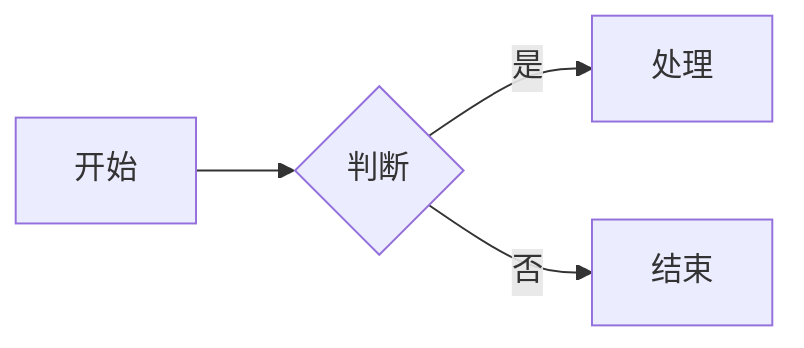

# 组件使用说明

本站 Markdown 支持 **Obsidian 双链嵌入** 与少量 **Vue 组件标签**。资源文件统一放在 `docs/` 下，与当前文档同级目录组织。

## 资源目录约定

与某篇文档 `docs/章节/文章.md` 同级的资源目录：

```
docs/章节/
├── 文章.md
├── img/          ← 图片（png、jpg、gif、webp、svg 等）
└── excel/        ← 表格（xlsx、xlsm、xls）
```

示例：本文位于 `docs/网址工具等/组件使用.md`，则图片放 `docs/网址工具等/img/`，表格放 `docs/网址工具等/excel/`。

开发时资源直接从 `docs/` 读取；构建时会复制到发布目录，**无需**放到 `public/`。

---

## 图片 `imgUtils`

使用 Obsidian 嵌入语法，自动解析为 `imgUtils` 组件。

| 写法 | 说明 |
|------|------|
| `![[截图.png]]` | 显示 `img/截图.png` |
| `![[截图.png\|说明文字]]` | 同上，自定义 alt 文本 |

::: details 示例代码
```markdown
![[Pasted image 20260627153332.png]]
![[logo.png|站点图标]]
```
:::

![[Pasted image 20260627153332.png]]

- 点击可新窗口预览大图
- 支持中文路径与文件名

---

## 表格 `tableUtils`

使用 Obsidian 语法引用 **当前文档同级** `excel/` 下的 xlsx 文件。

| 写法 | 说明 |
|------|------|
| `![[dummy.xlsx\|Motor-42]]` | 嵌入表格，指定工作表名 |
| `![[dummy.xlsx]]` | 嵌入表格，未指定时尝试匹配或取第一个工作表 |
| `[[dummy.xlsx\|Motor-42]]` | 链接式写法，效果同上 |
| `[[dummy.xlsx]]` | 链接式，未指定工作表名 |

::: details 示例代码
```markdown
![[dummy.xlsx|Motor-42]]
[[learnJava.xlsx|spring]]
```
:::

![[dummy.xlsx|Motor-42]]

注意：

- xlsx 文件须为有效文件（不能是 0 字节空文件）
- `|` 后为 **Excel 工作表名称**（Sheet Name），不是文件名

---

## 矢量图 `svgUtils`

在 Markdown 中直接使用 Vue 组件标签，将 SVG 代码放在组件内部。容器可拖拽平移，适合较大流程图。

::: details 示例代码
```html
<svgUtils>
  <svg xmlns="http://www.w3.org/2000/svg" width="400" height="200" viewBox="0 0 400 200">
    <rect x="10" y="10" width="120" height="40" fill="#fff" stroke="#000"/>
    <text x="30" y="35">示例</text>
  </svg>
</svgUtils>
```
:::

<svgUtils>
  <svg xmlns="http://www.w3.org/2000/svg" width="400" height="120" viewBox="0 0 400 120">
    <rect x="10" y="10" width="120" height="40" rx="6" fill="#fff" stroke="#333"/>
    <rect x="160" y="10" width="120" height="40" rx="6" fill="#fff" stroke="#333"/>
    <line x1="130" y1="30" x2="160" y2="30" stroke="#333"/>
    <text x="42" y="36" font-size="14">步骤 A</text>
    <text x="192" y="36" font-size="14">步骤 B</text>
  </svg>
</svgUtils>

---

## 流程图 Mermaid

使用 fenced code block，语言标记为 `mermaid`（由 `vitepress-plugin-mermaid` 提供）。

::: details 示例代码
````markdown

````
:::


---

## 代码块折叠

默认对 **≥ 4 行** 的代码块折叠，仅显示前 3 行。单页可在 frontmatter 关闭：

```yaml
---
cbf: false
---
```

---

## 语法对照

| 类型 | 推荐写法 | 是否 Obsidian |
|------|----------|---------------|
| 图片 | `![[file.png]]` | 是 |
| 表格 | `![[file.xlsx\|Sheet]]` | 是 |
| SVG | `<svgUtils>...</svgUtils>` | 否 |
| Mermaid | ` ```mermaid ` 代码块 | 否 |

不支持在 Markdown 中手写 `<tableUtils urls='...'>` 或 `<imgUtils urls='...'>`，请统一使用上表中的 Obsidian 或组件写法。
